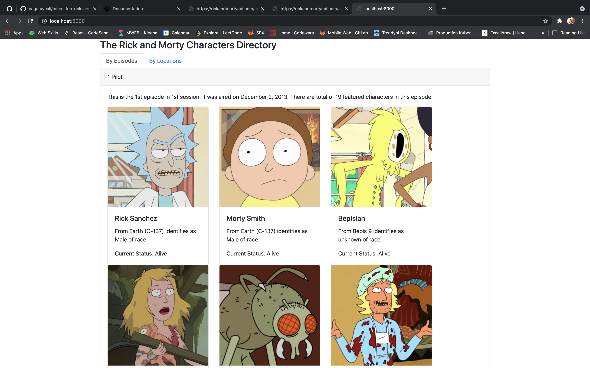

# Rick & Morty Directory

4 find TODO's search entire codebase: `TODO: @cagataycali`

# Changelog

```
**commit 3abe77f20331ffdd7113f7d2efa818b99bb5984c**
Author: cagataycali <cagataycali@icloud.com>
Date:   Tue Mar 30 02:19:40 2021 +0300
🎉  Init codebase
```


# Micro Frontend Fun (Not blazing fast)

This project is a template for your next micro-frontend project.

# Example usage:

https://github.com/cagataycali/micro-fun-example

# Usage of template

```bash
git clone git@github.com:cagataycali/micro-fun.git
```

# Scaffold a boilerplate for micro fragment

```bash
FUN_FRAGMENT_NAME=Header FUN_PORT=3000 ./copy.sh header
FUN_FRAGMENT_NAME=Footer FUN_PORT=3001 ./copy.sh footer
FUN_FRAGMENT_NAME=Avatar FUN_PORT=3002 ./copy.sh avatar

./install.sh header
./install.sh footer
./install.sh avatar
```

# Start

```bash
./start.sh footer # in first terminal
./start.sh header # in second terminal
./start.sh avatar # in third terminal

# Edit composer project for concatenate project (uncomment examples.)
cd composer
yarn dev
```
